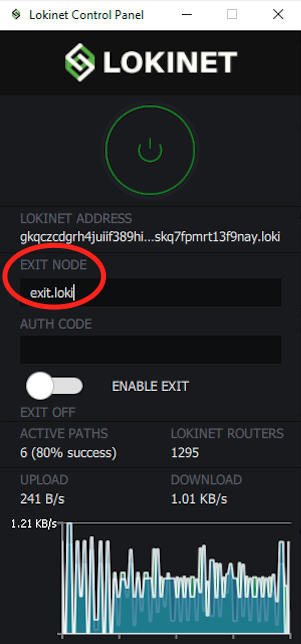
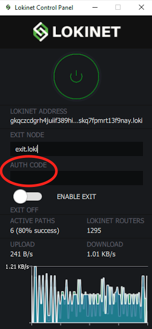
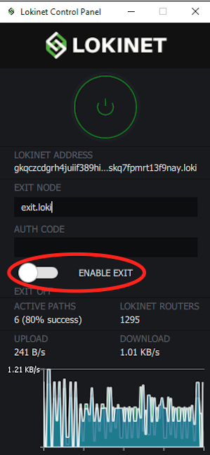

# 👋 Exit nodes

Lokinet's exit node functionality allows you to browse the normal Internet \(the 'clearnet'\) with all the privacy and security protections Lokinet provides. To use an exit node, all you need is a working Lokinet client and an exit node address \(the OPTF is currently operating a test exit node available at `exit.loki`, suitable for basic web browsing\).

### Using exit nodes with the Lokinet GUI client

Using exit nodes with the Lokinet GUI client is as easy as 1, 2, 3!

#### Step 1: Enter your exit node address

Open the Lokinet Control Panel and enter the address of the exit node you'd like to use \(e.g. `exit.loki`\) in the Exit Node box:



#### Step 2: Enter your exit node auth code \(if applicable\)

Some exit nodes may require an authentication code \(password\) to use \(note: `exit.loki`does not require an authentication code\). If the exit node you're using requires an authentication code, enter it in the Auth Code box:



#### Step 3: Enable!

With your exit address and auth code \(if applicable\) entered, all you need to do is click the switch next to Enable Exit:



Now turn on Lokinet \(if not already on\) with the big green power button, and you're ready to browse the internet with all the privacy protections of Lokinet.

### Using exit nodes with the Lokinet CLI client

To begin browsing from an exit node, use the following command, replacing EXITNODEADDRESS.loki with the address of your desired exit node:

```bash
lokinet-vpn --up --exit EXITNODEADDRESS.loki --token authcodegoeshere
```

To disable exit node functionality:

```bash
lokinet-vpn --down
```

