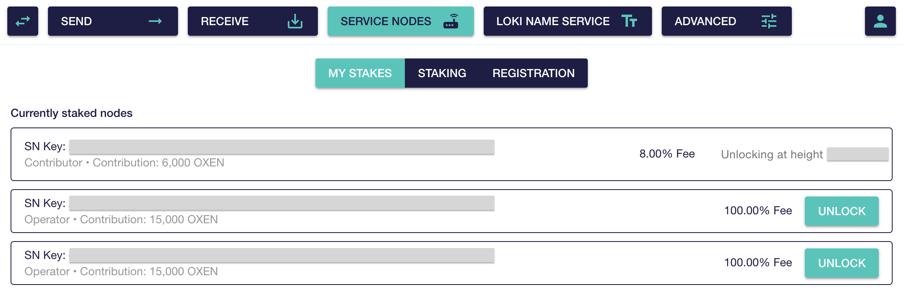

# 🍺 Full Service Node set-up guide

This guide will walk you through the complete process of setting up, staking, and running an Oxen Service Node. The guide targets non-experts, so even if you're new to Linux or the command line, you should be able to follow the text without any difficulty.

You can run the Oxen Service Node software on any device running a supported operating system, but for the purposes of this guide, we'll assume you will be setting up a Service Node on a remote Ubuntu or Debian server. If you're new to Linux or running servers in general, this is the most straightforward approach. If you're more experienced and would prefer to run your Service Node on a different operating system, you'll need to modify the syntax of some commands to suit your system of choice.

#### Running an Oxen Service Node: Requirements

These are the current basic requirements for running a Service Node as of October 2021. They will almost certainly increase in the future as the technologies powered by the Oxen network grow in popularity, so keep an eye on the [Oxen blog](https://oxen.io/blog) and join either our [Telegram community](https://t.me/Oxen_Community) or [Session open group](http://116.203.70.33/oxen?public_key=a03c383cf63c3c4efe67acc52112a6dd734b3a946b9545f488aaa93da7991238) for all the latest updates.

| Spec | Requirement |
| :--- | :--- |
| Latest Oxen Service Node software | Latest Service Node `.deb` packages \(installed via the steps below\) or latest [binaries](https://github.com/oxen-io/loki-core/releases) |
| Server operating system | Ubuntu 18.04+ or Debian 10+ |
| Storage | 40Gb or more |
| RAM | 2-4Gb \(2Gb is the absolute minimum\) |
| Connectivity | 100Mbps or faster |
| Traffic | 2Gb per month or more |
| Power | Redundant with remote cycling ability, as found in most data centres |

> Note: It is possible for an experienced system administrator to run a Service Node on a server running an operating system other than Ubuntu or Debian. However, this requires additional work to start up and manage the required services, and is beyond the scope of this guide.

### Table of Contents

* Oxen Service Nodes in a nutshell
* Set-up for new users
  * [Step 1: Obtaining a server](full-service-node-setup-guide.md#step-1-obtaining-a-server)
  * [Step 2: Preparing your server](full-service-node-setup-guide.md#step-2-preparing-your-server)
  * [Step 3: Initial repository set-up](full-service-node-setup-guide.md#step-3-initial-repository-setup)
  * [Step 4: Service Node installation and operation](full-service-node-setup-guide.md#step-4-oxen-service-node-installation-and-operation)
  * [Step 5: Service Node registration](full-service-node-setup-guide.md#step-5-service-node-registration)
  * [Step 6: Service Node status check ](full-service-node-setup-guide.md#step-6-service-node-status-check)
  * [Step 7: Unlocking your stake](full-service-node-setup-guide.md#step-7-unlocking-your-stake)
* Keeping your binaries up to date
* Monitoring
* Conclusion

### Oxen Service Nodes in a nutshell

* A Service Node starts as a full node on the Oxen network.
* The full node becomes a Service Node when the owner locks the required amount of $OXEN (see below) and submits a registration transaction.
* Once accepted by the network, the Service Node starts performing node operations and becomes eligible to receive periodic block [rewards](https://imaginary.stream/sn/) in the form of $OXEN.
* [Multiple participants can stake into one Service Node](staking-to-shared-service-node.md) and can have the reward automatically distributed among them.

#### Service Node functionality

Service Nodes:

* Receive, store, and forward encrypted [Session](../../products-built-on-oxen/session/) messages
* Route [Lokinet](../../products-built-on-oxen/lokinet/) traffic
* Monitor other Service Nodes and vote on their performance
* Are called into quorums that give them authority over [Blink](../../about-the-oxen-blockchain/blink-instant-transactions.md) transactions
* Produce new blocks for the network via [Pulse PoS](../../about-the-oxen-blockchain/pulse-pos-on-oxen/)

### Service Node set-up for new users

#### Step 1: Obtaining a server

Choosing where to set up your Service Node is the first and most critical decision you will face in setting up and running your node. There are a number of factors to consider. Because you will be locking up funds as part of operating your Service Node, you will want to ensure, at a minimum, that your server meets the technical requirements given above.

Your aim is to provide a stable, reliable server with good network connectivity, so that data can be efficiently routed to and from your node. An underpowered or poorly connected node will have a poor response time and add latency to the network for all users whose traffic passes through it, resulting in a less than optimal experience.

Additionally, you should consider the following factors. The more weight you attach to these factors when deciding where to run your node, the more value you will provide to the network.

Firstly, please consult the [node distribution](https://oxendashboard.com/#5) panel of the [Oxen Dashboard](https://oxendashboard.com/), where you will find a breakdown of the current Service Node network by country and network owner.

Here, you will see that some countries and network operators are currently overrepresented on the Service Node network. In other words, a relatively small number of countries and network operators account for the majority of the network. This is bad for decentralisation.

To be robust against disparate forms of attack, a distributed network must pursue diversity at multiple levels:

* Geographical diversity: distribution across multiple, disparate regions to minimise the effect of natural disasters
* Sociopolitical diversity: distribution across multiple countries and legal jurisdictions to minimise the effects of unrest, legislation, coercion and espionage
* Network diversity: distribution across multiple [tier 1](https://en.wikipedia.org/wiki/Tier_1_network) and [tier 2](https://en.wikipedia.org/wiki/Tier_2_network) network providers to minimise the effects of fire, flooding, network splits, equipment failure, cable rupture, bankruptcy, industrial espionage and rogue employees
* Software diversity: multiple operating systems, distributions and release variants to minimise the effects of events that target or otherwise afflict a particular system, such as a [zero-day vulnerability](https://www.kaspersky.com/resource-center/definitions/zero-day-exploit) or the push of a buggy package.

> **You can make a significant contribution to decentralisation and provide greater value to the network by taking the above factors into account when choosing where to run your node. Take care, however, not to compromise on the core requirements of a node when trying to satisfy these goals.**

If your server goes down while staked, your Service Node could be [deregistered from the network](service-node-deregistration.md) and your funds locked for 30 days \(without receiving rewards\).

For this reason, we strongly recommend against running a Service Node from home. Most consumer internet connections have poor upstream bandwidth \(Service Nodes require a high speed connection for both uploading and downloading data\) and typically don't provide a static IP address, which is essential for a Service Node. Connection speed and support aside, transient power and network outages are a relatively common occurrence with consumer-grade connections and can easily disrupt home servers.

Typically, the simplest and cheapest way to host a server such as an Oxen Service Node is to lease a Virtual Private Server \(VPS\). There are literally hundreds of options when it comes to VPS providers, but some of the more commonly chosen companies and products are listed below.

| Hosting Provider | Product Name | Cost Per Month \($USD\) |
| :--- | :--- | :--- |
| Netcup | VPS 1000 G8 | 10.50 |
| Evolution Host | STARTER | 5.50 |
| Online.net | Start-2-S-SSD | 13.99 |
| Scaleway | START1-M | 9.33 |
| OVH | VPS SSD 2 | 7.61 |
| Leaseweb | Virtual Server XL | 34.45 |
| Digital Ocean | 2 GB, 2 vCPUs | 15 |
| Linode | 4 GB, 2 vCPUs | 20 |
| Feral Hosting | Neon Capability | 19.68 |
| Trabia | VDS-8G | 38.54 |
| Hetzner | EX41-SSD \(30 TB\) | 39.71 |

> Note: We do not endorse **any** of these providers. The above list is merely a selection of some of the popular options at the time of writing. Of course, this popularity comes at the expense of decentralisation. To provide even greater value to the network, please consider running a node in a country and/or on a network that currently has poor or even no representation according to the [OXEN Dashboard](https://oxendashboard.com/#5). A useful resource in choosing a less common VPS provider is [ExoticVM](https://www.exoticvm.com).

In any case, do not just settle on the first provider you encounter. No two are alike. Do your own research and decide on a provider that seems professional, reputable and fits your budget. The better ones will utilise [KVM](https://www.linux-kvm.org/page/Main_Page) as the [virtualisation technology](https://www.tradingfxvps.com/kvm-vs-vmware-vs-openvz-vs-xen/) (as opposed to OpenVZ, for example, which is an incomplete virtualisation that allows VPS capacity to be oversold), allow you to monitor your VPS' resource consumption, perform a seamless upgrade to a more powerful server at a later date, remotely reboot the host if it becomes unresponsive, and even recover the system using out-of-band access if, for example, a bad configuration change results in lost network access.

When selecting your VPS’ operating system, please choose Ubuntu 20.04 or Debian 10 if you want to be able to follow the steps below verbatim. If you feel more confident and/or wish to run your server on another Linux distribution, the commands in this guide will still apply, but may need to be modified to suit your chosen operating system. In most cases, beginners and experts alike will be best served by sticking closely to this guide.

#### Step 2: Preparing your server

Every provider has a slightly different way of issuing you access to your new VPS. Most will send an email with the IP address, root username, and a root password to the VPS.

To access your server, you will need an SSH client for your operating system. Because we’re on Windows today, we’ll download PuTTY. Mac users can also use PuTTY. If you’re a Linux user, you probably don’t need us to tell you where to get an SSH client.

To connect to your VPS, you'll need to paste the provided IP address into the SSH client’s “Host Name \(or IP address\)” input box and click the “Open” button. The Port number can usually just be left as `22`.

A terminal window will now appear, prompting you for your log-in details, username \(`root`\) and password, as provided by your VPS provider. When entering your password, characters will not appear in the terminal. This is normal. Hit enter after typing or pasting your password, and you should be logged in to your VPS.

> Note: After logging in for the first time, the VPS may prompt you for a new password for the root account. The terminal will require you to enter the new password twice before you can start running commands. If you aren't prompted for a new `root` password but want to change it anyway, type `sudo passwd`. Choose something very secure!

#### 2.1: Hot tips for using the console on Windows

Consoles don't quite work like the rest of your computer. Here are some basic tips for navigating your way around the command line!

* Don't try copying something by using the usual `Ctrl + C` hotkey! If you want to copy something, do so by highlighting text and then right clicking it and selecting Copy. Pasting works by right clicking a blank area in the console and selecting Paste.
* If you want to kill a process or stop something from running, press `Ctrl + C`. \(This is why you shouldn't try copying something with this hotkey!\)
* You can always check the directory you are in by typing `pwd,` and you can list its contents by typing `ls`.
* You can always return to your home directory by typing `cd`and pressing Enter.
* You can move into a given directory by typing `cd <name>` or move back up one level by typing `cd ..`.
* PuTTY allows you to easily duplicate or restart a session by right clicking the top of the window. Handy if you’re trying to do a few things at once.

#### 2.2: Server preparation continued

Next, update your package lists _\(the lists that tell your server which software is available for install or upgrade\)_. The following command downloads package lists from their respective package repositories and "updates" them to get information on the newest versions of packages and their dependencies. It will do this for all repositories and PPAs.

```text
sudo apt update
```

You'll notice a bunch of package lists were downloaded. Once this is complete run the below command to fetch new versions of any packages that came preinstalled on the system.

```text
sudo apt upgrade
```

You'll be prompted to authorise the use of disk space. Type `y` and Enter to authorise.

If you are prompted during the upgrade that a new version of any file is available then click the up and down arrows until you are hovering over `install the package maintainer’s version` and click enter.

Alright, good to go. Our server is now set up, up to date, and is not running as root. On to the fun part!

#### 2.3: Firewall Configuration

If you are using a firewall then ensure that the following ports are open/reachable

* Port 22020 \(storage server to storage server\)
* Port 22021 \(client to storage server\)
* Port 22022 \(blockchain syncing\)
* Port 22025 \(Service Node to Service Node\)
* Port 1090  \(UDP, not TCP, unlike all of the above; Lokinet router data\)

#### Step 3: Initial repository setup

You only need to do this step the first time you want to set up the Oxen repository; when you've done it once, the repository will automatically update whenever you fetch new system updates.

To add the `apt` repository, run the following commands.

This first command installs the public key used to sign the Oxen Service Node packages:

```text
sudo curl -so /etc/apt/trusted.gpg.d/oxen.gpg https://deb.oxen.io/pub.gpg
```

The second command tells `apt` where to find the packages. **Note:** Replace `<DISTRO>`with the appropriate value to match your operating system. If your VPS is running Ubuntu 20.04 as recommended for this guide, replace `<DISTRO>` with `focal`. 

Otherwise, to check your `<DISTRO>` , run the following command: `lsb_release -sc`

Alternatively, your `<DISTRO>` can be found by using the following list:

* sid      \(Debian testing/unstable\)
* buster   \(Debian 10\)
* bionic   \(Ubuntu 18.04\)
* focal    \(Ubuntu 20.04\)
* groovy   \(Ubuntu 20.10\)

```text
echo "deb https://deb.oxen.io <DISTRO> main" | sudo tee /etc/apt/sources.list.d/oxen.list
```

Then resync your package repositories with:

```text
sudo apt update
```

#### Step 4: Oxen Service Node installation and operation

To install the software needed to run a Service Node, simply install the `oxen-service-node` package:

```text
sudo apt install oxen-service-node
```

This will detect your public IP \(or allow you to enter it yourself\) and automatically update the `/etc/oxen/oxen.conf` configuration file with the necessary additional settings to run a Service Node.

> Note: This process can take up to 6 hours for the blockchain to fully sync.

If you encounter an error during the syncing process due to a 15000 millisecond ping, you can run this command to fix it:

```text
sudo systemctl restart oxen-node.service
```

Alternatively, the blockchain can be typically be downloaded in a fraction of the time required to sync it via the network, using the following command:

```
sudo oxend-download-lmdb https://public.loki.foundation/loki/data.mdb
```

#### 4.1: Interacting with the running `oxend`

If you run the `oxend` command with an appended oxend command \(note that `sudo` is not required!\), the `oxend` command forwards this instruction to the running `oxend`. So, for example, to get the current `oxend` status you can run you would run:

```text
oxend status

oxend print_sn_status
```

To see the output log of your node you can run the following command:

```text
journalctl -u oxen-node -af
```

This is useful to see if your node is syncing with the blockchain and to see other diagnostic messages that may come up from time to time. \(Press `Ctrl-C` to stop watching the log\).

For a full list of supported commands run:

```text
oxend help
```

You can also get basic statistics \(such as uptime proof and ping times\) on the running daemons from the `systemctl status` commands:

```text
systemctl status oxen-node
systemctl status oxen-storage-server
systemctl status lokinet-router
```

#### Step 5: Service Node registration

This section of the guide is split into two parts:

* If you are an individual staker and do not require any other contributors to run your Service Node, jump into the [Individual staking ](full-service-node-setup-guide.md#6-1-individual-staking)section.
* If you want to run a pooled Service Node, jump into [Setting up a pooled Service Node](full-service-node-setup-guide.md#6-2-setting-up-a-pooled-service-node).

#### 5.0.1: Retrieving your wallet address

You'll need your wallet address to register your Service Node. Copy your primary address from the Oxen GUI wallet, or run the `address` command from within the Oxen CLI wallet, and copy the output.

> Note: Do not use subaddresses for staking. Subaddresses are currently unsupported for staking in the Oxen wallet.

#### 5.1: Individual staking

To run a Service Node as the sole contributor, you'll need:

* A fully synchronized, up-to-date Oxen daemon running on your Service Node
* An Oxen wallet with at least 15,000 $OXEN in it \(to meet the staking requirement to register your Service Node\)

#### 5.1.1: Preparing your node for registration

Log in \(if not already logged in\) to the VPS running the Service Node, then run the following command:

```text
oxend prepare_registration
```

The daemon will output the current staking requirement and prompt you with an input to clarify whether you are an individual staker or you will be running a pool. Type `y` and click enter, as you will be the sole staker.

The daemon will now prompt you for the operator's \(your\) Oxen address — this is the address saved in Step 5. Retrieve this address, copy it, then paste it into the terminal and press Enter.

The daemon will now ask for a final confirmation. If you agree with the information provided, type `y` and click enter.

The daemon will output a command which looks similar to:

```text
register_service_node 4294967292 T6TCCyDgjjbddtzwNGryRJ5HntgGYvqZTagBb2mtHhn7WWz7i5JDeqhFiHqu7ret56411ZJS7Thfeis718bVteBZ2UA6Y7G2d 4294967292 100.000000000 1535677391 ec3895ea70a4a91b5ec4b5e1df96a45e07046f1fb0123c754d98fb2d70f4529d 5bb35d7b8ab1acb943bc47913ada8f9d2e6d6e22264e57484a04c1bbfd461f0ee2e5435454cd9b7059b221eb506ce9ea4537ddd9faf1f1757e0ef611a41c0609
```

> _NOTE: You must run the command which **your** daemon outputs, and **not** the command shown above._

#### 5.1.2: Registering your Service Node

To stake and register your Service Node, open your Oxen GUI wallet \(with a balance of at least 15,000 $OXEN\). Navigate to the Service Nodes tab, then the Registration subsection. Paste the `register_service_node` command from Step 5.1.1 above, and click **Register Service Node**.

If you're using the Oxen CLI wallet, simply paste the registration command directly into the CLI wallet prompt and hit Enter.

Well done! Continue to [Step 6: Service Node check](full-service-node-setup-guide.md#step-6-service-node-status-check) to make sure your Service Node is running properly.

#### 5.2: Setting up a pooled Service Node

#### _Minimum contribution rules_

The Service Node staking requirement is fixed at 15,000 $OXEN. Service Nodes accept at most 4 contributions, meaning the minimum contribution to a Service Node is `<Remaining Staking Requirement> ➗ <Number of Remaining Contributors>`.

When setting up reserved spots in a pooled Service Node, the node administrator \(you\) must ensure the reserved stake amounts each meet the minimum staking requirement; contributors then simply stake their reserved amounts.

#### 5.2.1: Pool operator

The operator \(you\) is the individual who will be hosting the pool and running the server hosting the Service Node, thus incurring the operating expenses involved in running a node.

To be an operator, you'll need to have:

* A server running a fully synchronized, up-to-date `oxend`
* An Oxen wallet with at least 3750 $OXEN \(to meet the minimum Service Node operator staking requirement\)
* 1-3 other contributors who also have an Oxen wallet \(either the CLI or GUI wallet\) with enough $OXEN to meet their portion of the total stake
* If the operator wants to reserve contribution spots for specific contributors, the operator will need the addresses of the contributors and the amounts the 1-3 contributors will stake.

If you have the above ready, we can now prepare the Service Node.

Log in \(if not already logged in\) to the VPS running the Service Node, then run the following command:

```text
oxend prepare_registration
```

`oxend` will prompt you to specify if you will contribute the entire stake. Because you're running a pooled Service Node, type `n` and press Enter.

Next, `oxend` will request input for your desired operator fee. This value, which can be between 0-100, represents the percentage of the reward the operator will receive **before** the reward is distributed to all shareholders \(including you!\). For example, if you want to set up a 10% operator cut, you would type `10` and press Enter. 

> For example, imagine a Service Node with 4 contributors, including the operator, all staking equal amounts \(25%\). If the operator specified a 10% fee at this step, they would automatically receive 10% of the Service Node rewards, and the remaining 90% would then be split equally between the operator and the other 3 contributors.

The terminal will now display the minimum reserve the operator can contribute, and request input for the amount \(in Oxen\) you, as the operator, wish to contribute. Type your desired `<operator contribution>` and click return.

Once you've set your desired stake amount, you'll be prompted to either reserve spots for individuals that have already agreed to stake into the Service Node, or leave the pool open for anyone to contribute.

#### Option one: Reserved pool

If you want to reserve spots for specific contributors, type `y` at this prompt and click return.

The terminal will now prompt you for the number of additional contributors you've organised to stake into this Service Node. Type in the number of reserved contributors, **not including yourself**, and press Enter.

The daemon will now prompt you for the operator's \(your\) Oxen address — this is the address saved in Step 5. Retrieve this address, copy it, then paste it into the terminal and press Enter.

Next, you need to input the amount of Oxen each contributor will stake, and the Oxen Walled Address of the specific contributor\(s\).

> _NOTE: It is possible to reserve only some of the required total stake for specific contributors, while leaving the remaining staking amount open for other contributors._

The daemon will display a summary of the information you've entered. This is your chance for a final check over to make sure the correct information has been entered. To confirm the information is correct, type `y` and press Enter.

#### Option two: Open pool

If the operator wishes to leave their pool complete open to contributions they should type `n` at the reservation prompt and type Enter. The terminal will prompt you to input your address. Once your address has been entered, the terminal will display the remaining portion that needs to be contributed by others. If you agree, click `y` and hit return.

The daemon will display a summary of the information you've entered. This is your chance for a final check over to make sure the correct information has been entered. To confirm the information is correct, type `y` and press Enter.

#### Step 5.2.2: Registering your shared Service Node

Regardless of which option \(closed or open\) you've gone with, the daemon will output a command which looks similar to:

```text
register_service_node 4294967292 T6TCCyDgjjbddtzwNGryRJ5HntgGYvqZTagBb2mtHhn7WWz7i5JDeqhFiHqu7ret56411ZJS7Thfeis718bVteBZ2UA6Y7G2d 4294967292 100.000000000 1535677391 ec3895ea70a4a91b5ec4b5e1df96a45e07046f1fb0123c754d98fb2d70f4529d 5bb35d7b8ab1acb943bc47913ada8f9d2e6d6e22264e57484a04c1bbfd461f0ee2e5435454cd9b7059b221eb506ce9ea4537ddd9faf1f1757e0ef611a41c0609
```

> _NOTE: You must run the command which **your** daemon outputs, and **not** the command shown above._

Copy the whole line of text in your daemon and paste it into your notepad, as you'll need to run this command from within your Oxen GUI \(or CLI\) wallet.

You have 2 weeks from the moment of registering the Service Node to run the `register_service_node` command, however it is advised to do it as soon as possible.

Before you disconnect from your VPS, run the following command:

```text
oxend print_sn_key
```

This will output a bunch of information about your Service Node, but there's one part we're interested in at this stage: the long string of random letters and numbers after the characters `SN:` . This string is your Service Node's public key, used to identify your Service Node on the list of registered and operational Service Nodes. Select and copy the public key \(do not copy any of the surrounding information\).

On your local machine, open your Oxen GUI or CLI wallet and make sure your wallet contains at least 15,000 $OXEN to meet the Service Node staking requirement. Once you're in your wallet and have checked the balance, run the command which was provided above when you ran the `prepare_registration` command. The wallet will prompt you to confirm your password, then the amount of $OXEN to stake. Confirm this by typing `y` and clicking enter.

Once this command completes, your staking transaction will be sent to be included on the blockchain. It may take a few minutes for the transaction to be mined into a block; you can check the status using the following command:

```text
oxend print_sn_status
```

You can also check your node's status by looking for your `<Service Node Public Key>` in the "Service Nodes Awaiting Contributions" section on [the Oxen block explorer](https://oxen.observer/).

Once the Service Node registration is received, you can send the `<Service Node Public Key>` to your contributors, along with the amount of $OXEN they are required to stake.

At this point, you'll need to wait until all contributors have staked before the Service Node activates and becomes eligible to begin receiving rewards.

#### Staking to a shared node as a contributor

For a guide on staking to a shared Oxen Service Node as a contributor, [see here.](staking-to-shared-service-node.md)

#### Step 6: Service Node status check

After you've staked to your Service Node \(or after all contributors have staked, if you're running a shared node\), you'll need to check if your Service Node's public key is on the list of Service Nodes which are operational on the network. This will prove that your Service Node is running, recognised, and eligible to receive rewards.

Connect to the VPS where the Service Node is running and run the following command to retrieve your Service Node's public key:

```text
oxend print_sn_key
```

This will output a long string of letters and numbers: your Service Node's public key. This public key is used to identify your Service Node on the list of registered and operational Service Nodes. Select and copy the public key.

You can now jump onto [oxen.observer](https://oxen.observer/), open the full list of active Service Nodes, and use `Cmd+F`/`Ctrl+F` to check if your Service Node's public key appears in the list.

#### Step 7: Unlocking your stake

Service Nodes will continually receive block rewards indefinitely until a stake is unlocked or the Service Node becomes deregistered. To unlock your stake, simply open the Oxen GUI Wallet and navigate to the Service Nodes &gt; My Stakes tab. You can then click Unlock for any stake you wish to unlock:



You can also unlock your stake by running the following command from the [Oxen Command Line Interface \(CLI\) Wallet](../oxen-wallet-guides/cli-wallet-commands.md):

```text
request_stake_unlock <service node key>
```

The Service Node will expire 15 days \(10800 blocks\) after the unlock is requested, and your staked $OXEN will then become unlocked after expiry.

For pooled nodes, any contributor can submit an unlock request. This will schedule the Service Node for expiration. All locked stakes in that Service Node will be unlocked 15 days \(10800 blocks\) after the unlock is requested. Once an unlock is requested, this process can not be undone or prolonged. Service Node participants will continue receiving rewards until the node expires.

[Deregistrations](service-node-deregistration.md) can be issued at any point during the active lifecycle of a Service Node, including during the period after requesting an unlock. Deregistration removes your Service Node from the network, and your stake\(s\) become locked and unspendable for 30 days \(21600 blocks\) from the block in which the Service Node was deregistered.

Receiving a deregistration **after** participant\(s\) have already requested an unlock overrides the 15-day \(10800-block\) stake unlock time, and sets the unlock time to 30 days \(21600 blocks\).

```text
print_locked_stakes
```

### Keeping your binaries up to date

When a new release is available, upgrading is as simple as syncing with the repository:

```text
sudo apt update
```

Then installing updates using:

```text
sudo apt upgrade
```

> Note that this will install both updated `oxend` packages _and_ any available system updates \(this is generally a good thing!\).

During the upgrade, all instances of `oxend` will be restarted if they are currently running in order to switch to the updated `oxend`.

If for some reason you want to install _only_ Oxen package upgrades but not other system package updates, then instead of the `sudo apt upgrade` you can use:

```text
sudo apt install oxen-storage-server oxend lokinet-router
```

### Monitoring

We highly recommend setting up monitoring for your Service Node. This is as simple as calling on the services of our Telegram or Discord bot. Contact `@LokiSNBot` on Telegram or `OxenSNBot#5812` on Discord and type `/start` or `$help` respectively to get started.

Another helpful tool is Konstantin Ullrich's [Oxen Service Node Operator app](https://play.google.com/store/apps/details?id=dev.konsti.oxen_service_node) for Android.

### Conclusion

Well done! Your Service Node is configured, operational, and will now begin receiving rewards.

For tips and tricks to maintain your Service Node, check out [Service Node tools and upkeep](service-node-tools-upkeep.md).

Having trouble? Just [head to our Support section](../../support.md).
