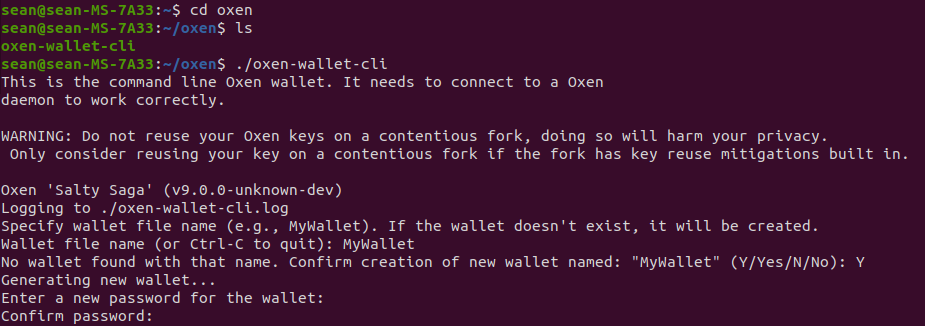
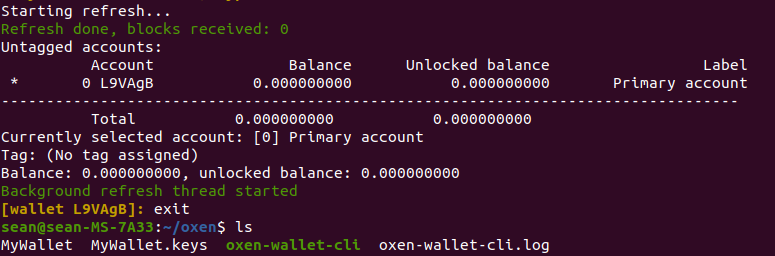
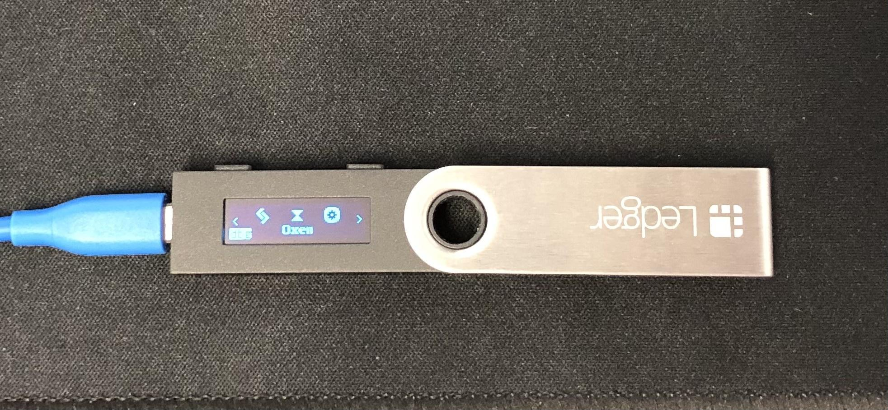
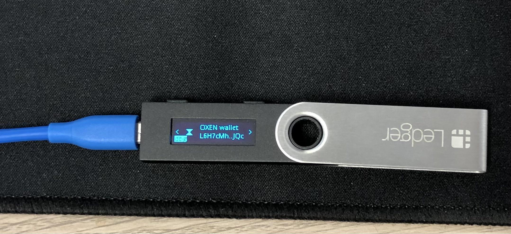
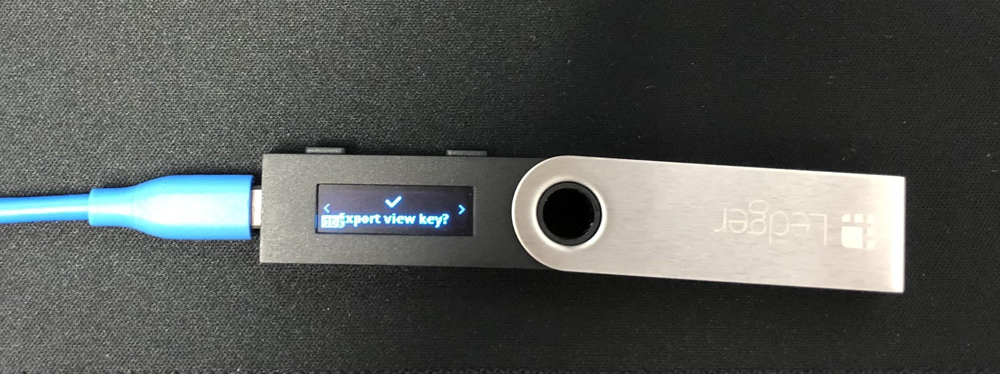
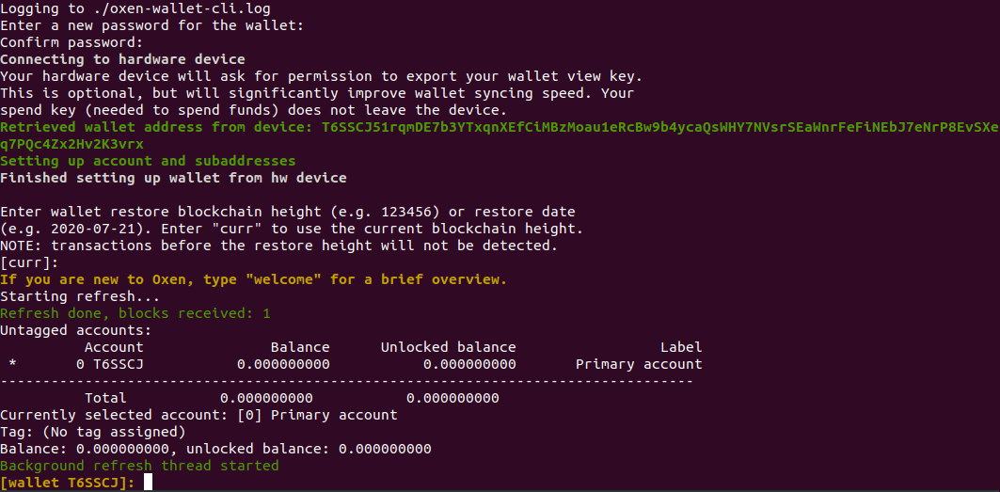
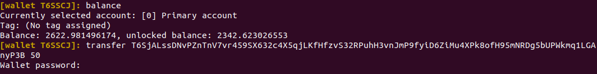
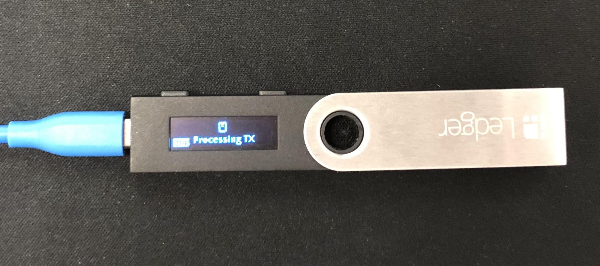
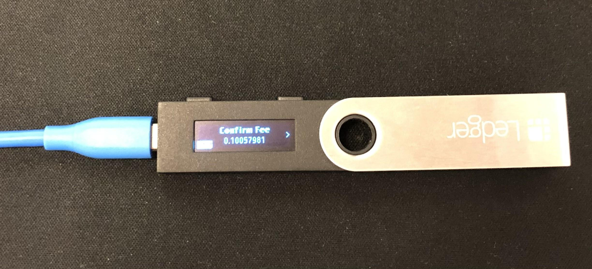
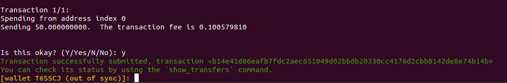

# Oxen Ledger Wallet setup: CLI Wallet

**Background Information**

The Ledger hardware wallet stores your private keys on-device so as to isolate your private keys from your PC \(which can be at risk of viruses and other attacks\). The use of a hardware wallet changes the way you interact with your software slightly.

The **oxen-wallet-cli** software usually creates 2 files which it uses for processing transactions. The files are named after your wallet name which you specify during startup.

After this initial step you will see the two files:

1\) MyWallet – Large File ~15Mb

2\) MyWallet.keys – Small File ~ 1.4Kb

The first file contains the saved state of the Oxen wallet. The wallet processes encrypted transactions on the blockchain and then records your unspent transactions here.

The second file contains your encrypted private keys.

When using the Ledger hardware wallet, the **oxen-wallet-cli** software will still create the first file to save the wallet state but the second file no longer contains your private keys. Instead, they will be saved securely on the hardware device \(note: public keys and view keys, if exported, will still be saved here\). This changes the process that **oxen-wallet-cli** will follow in order to sign a transaction.

**Without** a hardware wallet: **oxen-wallet-cli** will craft an unsigned transaction, then will reference the MyWallet.keys file to prepare a signed transaction which it will submit to the mempool and broadcast out to the Oxen network.

**With** a hardware wallet: **oxen-wallet-cli** will craft an unsigned transaction then submit it to the Ledger hardware wallet for signing. The Ledger hardware wallet will return a signed transaction to **oxen-wallet-cli** which the software will then submit to the network.

### **Steps to generate a wallet using the Ledger**

Before being able to generate an Oxen wallet on the ledger you will need to have initialized your Ledger and should have your 24 word mnemonic seed previously generated.

You will also need to have the Oxen App installed on your Ledger.

The first step is to connect the Ledger to your PC via the microUSB cable and run the Oxen Ledger App.

Next, ensure that your daemon \(`oxend`\) is running with a fully synced blockchain \(alternatively, you can connect **oxen-wallet-cli** to a remote node\)

Navigate to the directory where **oxen-wallet-cli** is located \(the following commands assume **oxen-wallet-cli** is located in the home directory and under a folder called oxen\) and call the software using the “generate-from-device” flag

`cd ~/oxen`

`./oxen-wallet-cli --generate-from-device <NEW_WALLET_NAME>`

Replace &lt;NEW\_WALLET\_NAME&gt; with your desired wallet name. For instance if you want to name your wallet _MyLedgerWallet_ you would use the following command:

`./oxen-wallet-cli –generate-from-device MyLedgerWallet`

The CLI will execute the command, then prompt you for a password to encrypt the wallet state information file mentioned above.

The Ledger device will ask you to confirm whether you want to export the private view key. This view key is used to search and decrypt the transactions in blockchain. Exporting this key to the software will enable **oxen-wallet-cli** to search the blockchain \(rather than the Ledger device itself\). The **oxen-wallet-cli** client will be able to search the blockchain significantly faster if you export the private view key. It should be noted that your funds cannot be compromised by this view key, but if an attacker was to obtain this key they could scan and identify your incoming transactions, which would be detrimental to your privacy.

Navigate using the left and right buttons on the Ledger to either the accept or reject screen and press both buttons simultaneously to confirm your choice. After confirming, the Ledger will then generate your wallet. Note this may take 5-10 minutes and the Ledger will not provide immediate feedback while doing so.

Next you will be prompted to enter the wallet restore height. This lets the wallet know that it can stop searching the blockchain for transactions prior to this block. If this is a new wallet then you can safely use the default \[curr\] by pressing Enter; if this is a wallet that has previously received transactions, then enter an appropriate restore height, or 0 to restore from the very start of the blockchain \(a much slower process\).

After the wallet has been generated, **oxen-wallet-cli** will start refreshing \(scanning the blockchain for transactions\). Wait until it has fully refreshed.

Congratulations, you can now use your Ledger wallet in conjunction with the Oxen CLI wallet!CLI

### **Usage of the Oxen CLI wallet with the Ledger wallet**

You only use the --generate-from-device on the single occasion when creating the wallet. Going forward, you use the CLI wallet as usual but select the wallet file corresponding to the Ledger wallet.

Steps to use:

1. Make sure your Ledger is plugged in and the Oxen app is running.
2. Open **oxen-wallet-cli**
3. Enter the wallet name of your Ledger Oxen wallet. This is the same as the name of the wallet state file mentioned above.
4. Enter the password to open the wallet.

### **Sending a transaction using the Ledger**

1. Call **oxen-wallet-cli** from the same directory as the wallet file created above using the generate-from-device-flag

`./oxen-wallet-cli`

You will then be prompted to specify the wallet file name and enter the password. If you didn’t instruct your Ledger to always provide the view key, then your wallet will prompt you again for permission to provide it \(you can change this setting later in the Settings within the Ledger app\).

Afterwards, you will be able to enter commands into the wallet. This process is the same for both Ledger wallets and non-Ledger wallets, except that there will be an extra confirmation step on the Ledger before transactions can be submitted to the blockchain.

Enter the following command to transfer to another address:

`transfer <DESTINATION_ADDRESS> <AMOUNT>`

For example, transferring 50 Oxen to the following testnet address can be done via:

`transfer T6SjALssDNvPZnTnV7vr459SX632c4X5qjLKfHfzvS32RPuhH3vnJmP9fyiD6ZiMu4XPk8ofH95mNRDg5bUPWkmq1LGAnyP3B 50`

You will then be prompted to enter your password, and the Ledger device will start to process the transaction.

During this process, the Ledger will prompt you to confirm the following details of the transaction:

* Fee
* Recipient Address and Amount

After confirming the transaction on the Ledger wallet, the **oxen-wallet-cli** will also prompt you to confirm the transaction details. Typing ‘Yes’ to confirm will submit the transaction to the blockchain network

Congratulations, you have successfully transferred funds using the private keys saved securely on your Ledger.

### **Closing the wallet**

Care should be taken when closing the wallet. If the Ledger is powered off incorrectly, there is a risk of data corruption. Follow these steps to close the app safely:

1\) Shut down **oxen-wallet-cli** by typing “exit” and hitting Enter. The wallet will take a few moments to update the wallet cache file on disk.

2\) Close the Oxen Ledger App

3\) Unplug the Ledger device

