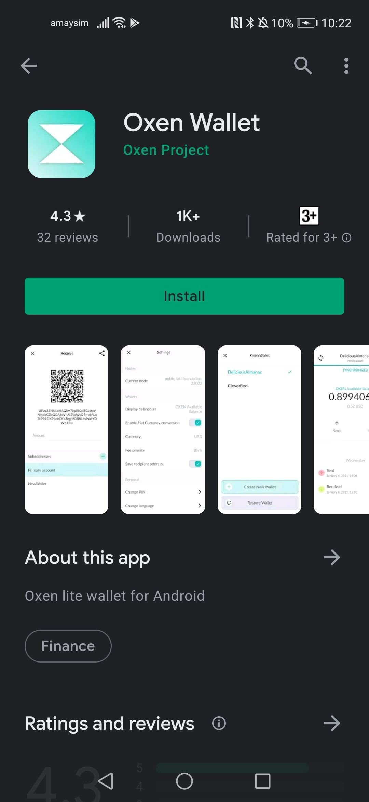
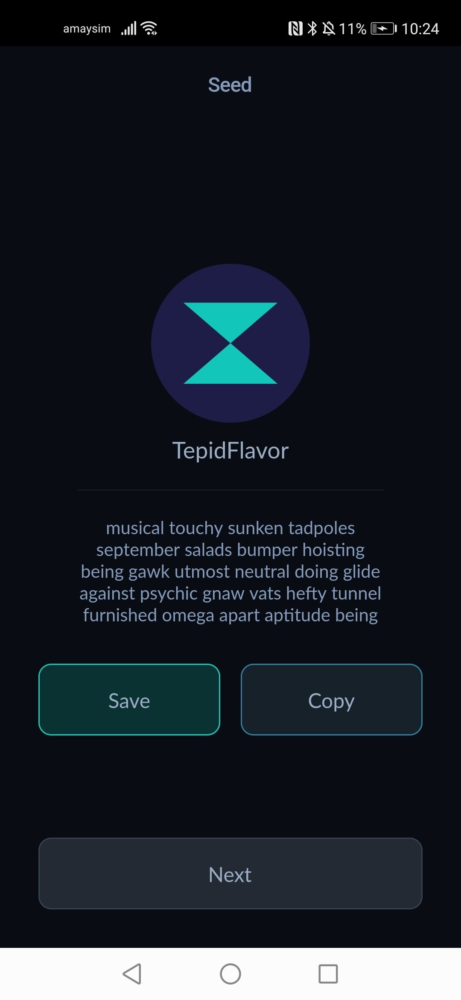
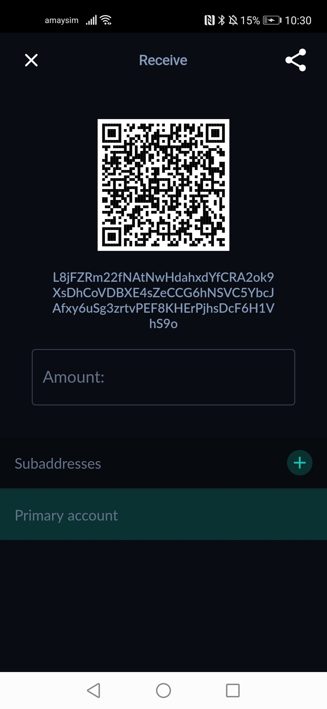
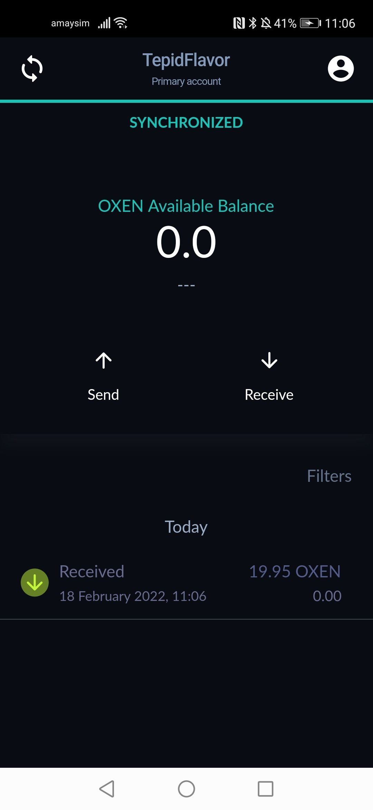
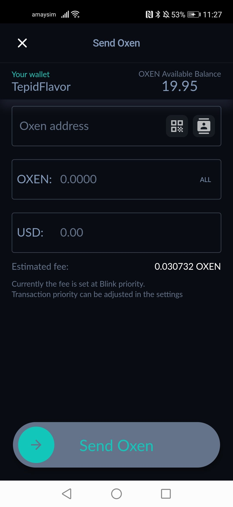
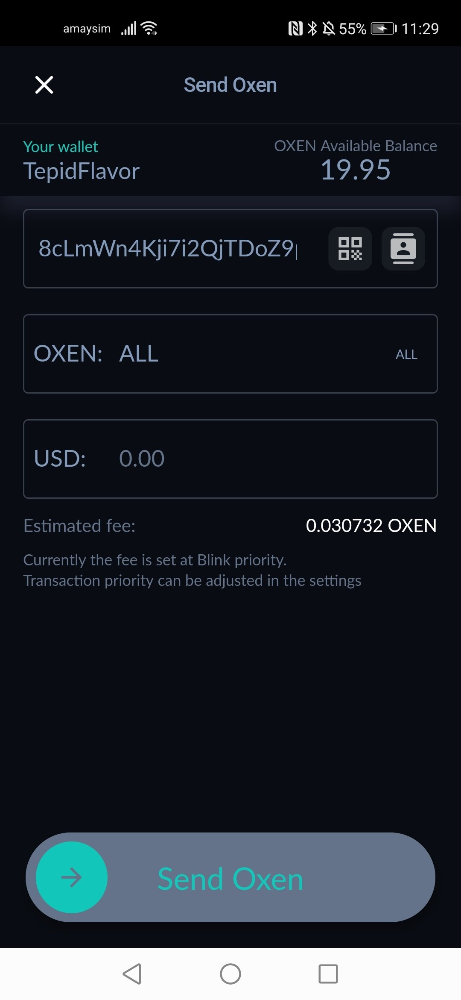
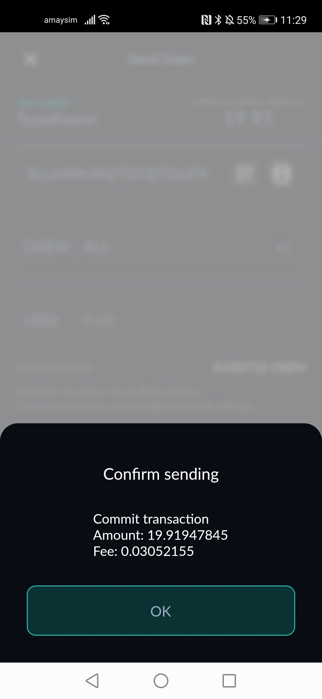

# Oxen Mobile Wallet Quickstart

This guide will walk you through using the Oxen Mobile wallet for the first time. This guide was created on an Android phone but the user experience of the Mobile wallet on iOS is identical.

### **General Workflow of the Mobile Wallet**

We will discuss in detail the process of creating & using the wallet later in this guide. But a quick overview of the GUI wallet is as follows. The main wallet page looks like this:

This page displays:

1\) Your wallet's available balance is shown front and centre in large text

2\) Buttons in the middle for sending and receiving transactions

3\) A list of historical transactions at the bottom

4\) At the top we have the name of the wallet "TepidFlavor" which you will create when making the wallet

5\) Your wallets synchronization status, in this photo the wallet is "Synchronized" which tells you how much of the blockchain your wallet has analysed

6\) On the top right is a profile icon which allows you to configure the wallet, access settings, generate new wallets and stake to Oxen Service Nodes

7\) The refresh icon on the right allows you to force refresh the blockchain and reconnect to the remote node if the wallet has synced incorrectly

### Installing from the Play Store

The mobile wallet can be downloaded from Google Play Store under Oxen Wallet.

You can find this app via this link:

[https://play.google.com/store/apps/details?id=io.oxen.wallet](https://play.google.com/store/apps/details?id=io.oxen.wallet)\
\
Please be mindful when downloading as the play store has been know to allow copycat apps designed to steal your crypto. The app developer is "Oxen Project" which is the same author as "Session" and "Loki Wallet" (Our old wallet app).

The iOS app can be found via this link:\
[https://apps.apple.com/us/app/oxen-wallet-rangeproof/id1547745078](https://apps.apple.com/us/app/oxen-wallet-rangeproof/id1547745078)

### Your first time opening the mobile wallet, receiving and sending funds.

Congratulations on downloading the mobile wallet. The first time you open the app you will need to create your wallet, do this by clicking "Create new" to continue.

### .jpeg>)

Your wallet is protected by a 4 or 6 digit PIN number. You will be required to enter this pin whenever you open the app and also when sending transactions. Enter a PIN you will remember.

 (1) (1) (1).jpeg>)

The first thing the app asks is for a name of the new wallet. These are simply used to give a distinguishable name to identify the wallet. Choose something that is memorable because your wallet list can become unwieldy rather quickly when creating multiple wallets. For this reason using names such as: Wallet1, Wallet2, Wallet3 etc are not recommended. The app also provides a random default name (In this case "TepidFlavor"). \

In addition you will need to choose a language for the seed phrase generated in the next step. The most important part of the wallet creation process is the creation of your “Seed Phrase”. This is shown in the next step. Select your native language here to make the recording of your seed phrase easier.

 (1) (1) (1) (1).jpeg>)

Below you can see the app has now generated 25 words that are used to generate the private keys of your wallet.

**Please note that these 25 seed words are by far the most important part of the wallet creation process. Write these somewhere safe! Don't lose them. If a malicious person gets access to these words they will be able to spend your funds. The Oxen team will NEVER ask you for your seed phrase and a person requesting them from you is likely a scammer trying to steal your funds.**

You won’t need to regularly use these seed words. But if/when you need to recover your wallet or move the wallet to a different device then everything can be rebuilt using these 25 words.

After you have saved your seed phrase click "Next" to proceed.

At this point you now are brought to the wallet main page. When you first open the wallet the software needs to process blocks on the blockchain to check for transactions that belong to you. While the wallet is doing this you will see the status bar at the top stating how many blocks are remaining.

When the wallet is synchronising it is normal and expected that your transactions are not processed and therefore won't be shown in the app. Please wait until the wallet shows "SYNCHRONIZED" to continue.

.jpeg>) (1) (1).jpeg>)

### Receiving Oxen

When purchasing Oxen from an exchange or requesting funds from another person you will need to provide your wallet address. Your wallet address is a 95 character text starting with “L”. This is shown by clicking on the "Receive" button:

A QR code is also provided that can be read by other users mobile wallets. If you enter a number into the "Amount" input box this will modify the QR code so the mobile wallet reading the QR code knows how much should be paid in the transaction.

Clicking on the address string ("L8jFZ...VhS9o) will copy the address to your phones clipboard.

When receiving funds from an exchange there will generally be some processing time from the exchange (This time varies depending on the exchange) then a transfer will occur on the blockchain which your wallet will recognise.

The wallet scans the blockchain to find transfers that belong to you, when it finds one it will be added to the transaction list at the bottom. If the wallet is not detecting your transfers the most common reason that the wallet is not yet fully synced.

You can also click into the transaction to show more details.

 (1) (1) (2).jpeg>)

Please note that your "Available Balance" will not update immediately. This is normal so don't worry, this is because the wallet enforces a 10 block (20 minute) waiting time before allowing you to spend recently received funds. The reasons for this are interesting and complicated but the TLDR is that as a privacy coin the wallet needs to be mindful of statistical attacks, and spend transactions that occur immediately after receiving funds are easily traceable, which reduces the privacy of all the transactions the blockchain (not just your own transactions).

After 10 blocks your available balance will update and you can then spend/stake your coins:

.jpeg>)

### Spending Oxen

From the main app display click "Send" to bring up the following page:

To send funds you will need to obtain the address of the recipient. This will be a 95 character text string provided by the recipient. Usually you will copy and paste this address into the "Oxen address" text box, however you can also click on the QR code button to scan the address through the mobile phones camera.

You will also need to enter in the amount that is to be transferred. This can be specified in the "Oxen" text box which represents number of whole oxen to be transferred.

Alternatively you can enter the amount value in USD, which will automatically calculate the correct amount of oxen to transfer using current market rates. You only need to enter the amount into one field.

When sending transactions on the blockchain there is always a small fee charged to the sender. The wallet shows an estimate on this page (but will confirm the exact amount at a later point).

To proceed with the transaction slide the "Send Oxen" slider to the right. You will be asked to enter your PIN and the final details of the transaction will be displayed.\

The final amounts will be shown and the exact fee displayed. To confirm the transaction and send to the network click "OK". After this point the app should display "Transaction Sent"

.jpeg>)

After this point your transaction will have been sent to the network. After the nodes confirm this transaction into the blockchain your transaction will then appear in the transaction list on the main display screen.

.jpeg>)

And that's it! You have successfully used the wallet to send and receive a transaction!

